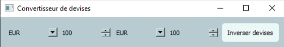

<div id="top"></div>

<div align="center">
  <h1> Currency Converter </h1>
  <p>A little application to convert number in an other currency</p>
</div>

***

### Table of Content
1. [General Info](#general-info)
3. [Visual](#visual)
4. [Technologies](#technologies)
5. [Installation](#installation)
6. [Contributing](#contributing)
7. [Contact](#contact)
<p align="right">(<a href="#top">back to top</a>)</p>

***

### General Info
Realization of a complete application to convert number in an other currency in Python with PySide2
<p align="right">(<a href="#top">back to top</a>)</p>

***

### Visual
Here is an overview of project. </br>

<p align="right">(<a href="#top">back to top</a>)</p>

***

### Technologies
- Python
- PIP
- PySide2
- POO
<p align="right">(<a href="#top">back to top</a>)</p>

***

### Installation

1. Clone the project
```
git clone https://github.com/LiseRochat/Currency-Converter
```
2. Open file with you text editor 
3. Create a virtual env
4. Install PySide2
5. Install currency converter
6. Run 
<p align="right">(<a href="#top">back to top</a>)</p> <br>

***

### Contributing
If you have a suggestion that would make this better, please fork the repository and create a pull request. You can also simply open an issue with the tag "enhancement".

Don't forget to give the project a star! Thanks again!

1. Fork the Project
2. Create your Feature Branch (`git checkout -b feature/AmazingFeature`)
3. Commit your Changes (`git commit -m 'Add some AmazingFeature'`)
4. Push to the Branch (`git push origin feature/AmazingFeature`)
5. Open a Pull Request
<p align="right">(<a href="#top">back to top</a>)</p>

***

### Contact 
Rochat Lise - liserochat@live.fr </br>
Project Link: [https://github.com/LiseRochat/Currency-Converter](https://github.com/LiseRochat/Currency-Converter)
<p align="right">(<a href="#top">back to top</a>)</p>


